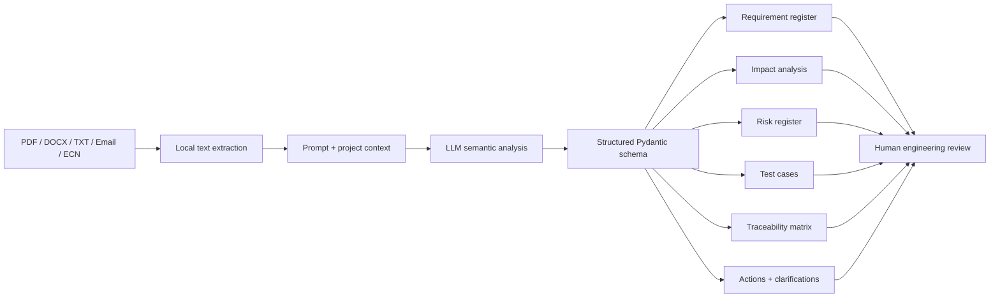

# Architecture

## Key design decisions

1. **Local extraction first**: the MVP extracts text from common documents before sending the text to the LLM.
2. **Structured output**: the model is constrained to a typed schema rather than returning an unstructured essay.
3. **Explicit vs inferred**: impact rows must state whether they are directly specified or inferred.
4. **No invented standards**: the prompt forbids adding standards/numeric requirements absent from source documents.
5. **Human-in-the-loop**: output is positioned as decision support and draft verification material.
6. **Demo reliability**: a bundled analysis lets you present the complete UX even if internet/API access fails.
